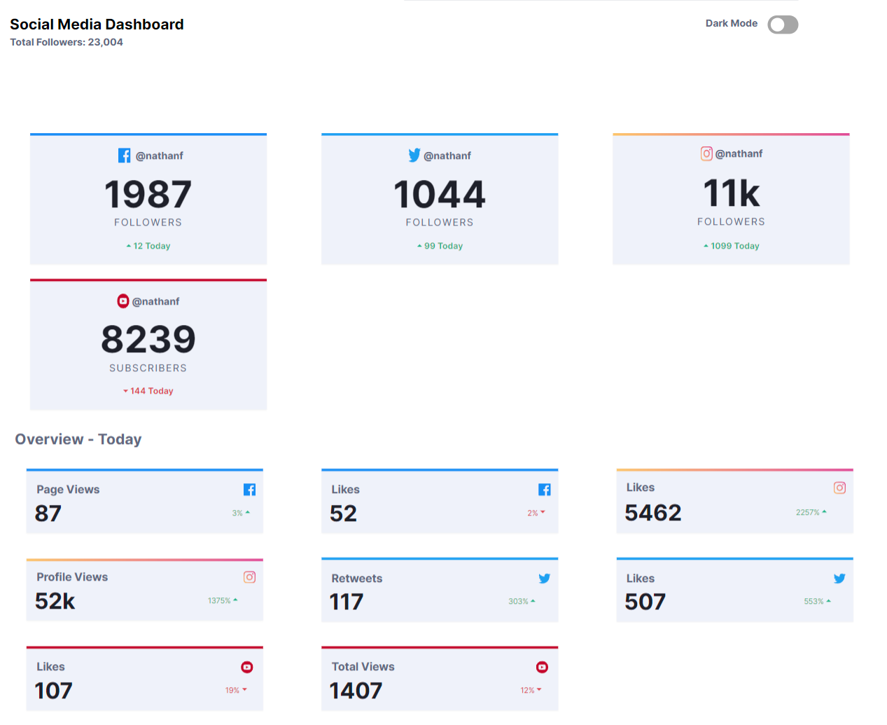
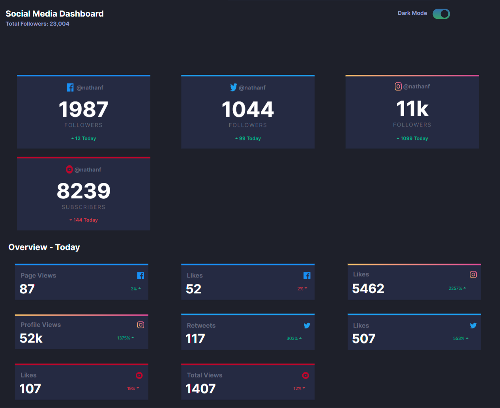
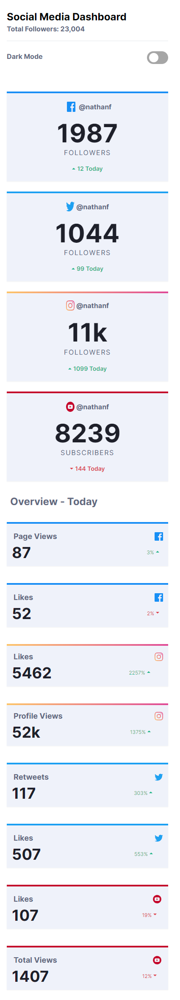
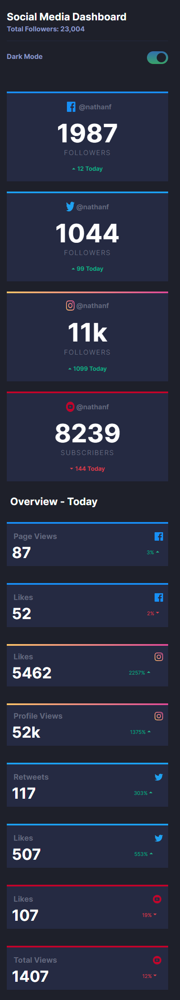

# Social Media Dashboard with Theme Switcher

This is a solution to the [Social media dashboard with theme switcher challenge on Frontend Mentor](https://www.frontendmentor.io/challenges/social-media-dashboard-with-theme-switcher-6oY8ozp_H). Frontend Mentor challenges help you improve your coding skills by building realistic projects.

## Demo

You can view a live demo of the application at [Live Demo](https://your-live-site-url.com).

## Overview

### The Challenge

Users should be able to:

- View the optimal layout for the site depending on their device's screen size
- See hover states for all interactive elements on the page
- Toggle color theme to their preference

### Features

- Display follower counts and engagement metrics for Facebook, Twitter, Instagram, and YouTube
- Toggle between light and dark themes for the dashboard

## Technologies Used

- React (JavaScript library for building UI components)
- Next.js (React framework for server-side rendering and routing)
- Tailwind CSS (Utility-first CSS framework)
- React Context API (for managing dark mode state)

## Installation

To run the application locally, you'll need Node.js and npm (Node Package Manager) installed on your machine.

1. Clone the repository:

```bash
git clone https://github.com/your-username/your-repo-name.git

cd your-repo-name
```

## Usage
```bash
npm run dev
```

## Screenshots

### Desktop





### Mobile






## What I Learned

```js
// DarkModeContext.js

import { createContext, useState } from 'react';

export const DarkModeContext = createContext();

export const DarkModeProvider = ({ children }) => {
  const [darkMode, setDarkMode] = useState(false);

  return (
    <DarkModeContext.Provider value={{ darkMode, setDarkMode }}>
      {children}
    </DarkModeContext.Provider>
  );
};
```

```js
// useDarkMode.js

import { useContext } from 'react';
import { DarkModeContext } from './DarkModeContext';

export const useDarkMode = () => {
  return useContext(DarkModeContext);
};
```

```jsx
// Example usage of Tailwind CSS classes in React components

<div className="container flex-col min-w-full ps-4 pe-7 dark:bg-dark-very-dark-blue-bg min-h-screen ">
  <section className="container grid grid-rows-2 grid-cols-1 divide-y dark:divide-dark-dark-desaturated-blue-card-bg sm:grid-cols-2 grid-rows-1 mr-0">
    <!-- ... -->
  </section>

  <section className="grid  grid-cols-1 grid-rows-4 gap-10 my-6 place-items-center min-h-max sm:grid-cols-3 sm:grid-rows-2 gap-6">
    <!-- ... -->
  </section>

  <h1 className="text-light-dark-grayish-blue-text text-2xl font-bold p-2 dark:text-dark-white-text"> Overview - Today </h1>

  <section className="grid grid-rows-auto gap-10 my-6 place-items-center min-h-max max w-full sm:grid-cols-3 ">
    <!-- ... -->
  </section>
</div>
```


## Contributing

Contributions are welcome! If you find any issues or want to enhance the application, feel free to submit a pull request.


## Author

Botir Khaltaev
GitHub: @botirk38
Frontend Mentor: @botirk38


